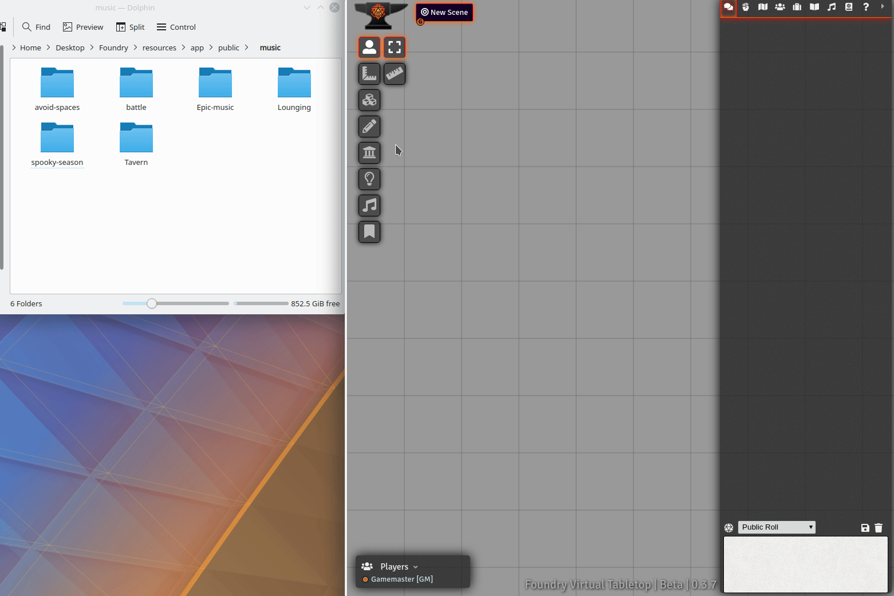
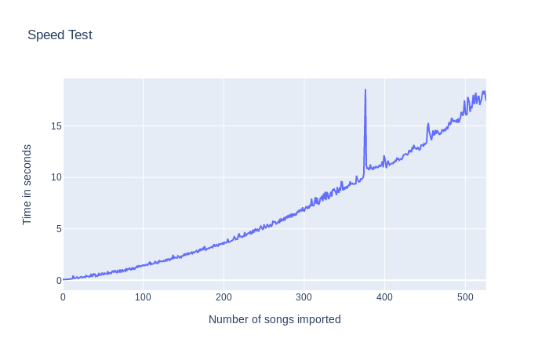

# Playlist importer 


 

[](https://forge-vtt.com/bazaar#package=playlist_import) 


[](https://www.foundryvtt-hub.com/package/playlist_import/)


# [THIS MODULE IS BEEN TRANSFERED HERE](https://github.com/p4535992/foundryvtt-playlist-import)

This module aims to simplify the process of adding multiple music tracks to Foundry VTT, allowing for bulk importation of songs.

If you're like me, you probably enjoy amassing a large collection of songs to play for your players! However, importing your songs one at a time can be sluggish and time consuming. Playlist importer allows you to bulk import all of your songs!

I will only personally be maintaining the most recent version of foundry. In short, this means you may not get backwards compatibility for any breaking changes.
Fortunately, you should be able to use releases to download a compatible version if it exists.



## Installation

It's always easiest to install modules from the in game add-on browser.

To install this module manually:
1.  Inside the Foundry "Configuration and Setup" screen, click "Add-on Modules"
2.  Click "Install Module"
3.  In the "Manifest URL" field, paste the following url:
`https://raw.githubusercontent.com/JacobMcAuley/playlist_import/master/module.json`
4.  Click 'Install' and wait for installation to complete
5.  Don't forget to enable the module in game using the "Manage Module" button

## Known issue

- The dialog need some very adjustament, for now just ignore whart you see, for lack of the time on developer side, anyone is welcome to open a PR with a loading dialog.

### Features

1. Allows for quick importation of songs into FVTT
2. Only adds songs that haven't been added already (can be disabled) . NOTE: This applies only for songs added by Playlist-importer 
3. Delete imported playlist
4. Build playlist by following the hiearchy of folder or one paylist fr every folder

### It's a feature not a bug!

Please read the following, as it may answer any questions as to unexpected behavior.

NOTE:
1. Currently only .mp3, .mp4, .ogg, .wav, .m4a and .flac files are imported. All other types are excluded. 
1. Organization is force upon you! This means, that when you select your base directory in which to import, only folders within the base directory are checked, not the files. In otherwords, you must subdivide your music into folders inside the base directory.
1. Songs added by playlist-importer will be excluded from being added again by the import function. This means, songs names should be unique! Make sure to avoid duplicate names across folders.
1. Nested folders will result in unsuccessful importations. This will be addressed in future builds
1. For general efficiency questions, refer to the "Efficiency" section below. 
1. Spaces in folder names should no longer cause issues. Please contact me if they cause trouble.

### Usage

*Note*: The paths are vague, as you may have a different data path for your instance of FoundryVTT. If you have questions, feel free to message me.
1. Download and install the mod, then enable it on Foundry.
2. Inside of your "/FoundryVTT/Data/" folder, create a new folder called "music" (or any category you prefer). 
3. Inside of your module settings, navigate to Playlist import and select the desire base directory (music in this example). 
    1. Note 1: If using S3, The Forge, or something similar be sure to select the proper source in the settings
    2. Note 2: If using S3 specifically, please name the bucket you are using within the "bucket" section of the playlist-importer settings. If you're not using S3, you can ignore this option.
4. Inside of your "/FoundryVTT/Data/music" folder, you *must* create subfolders, perhaps with genres and types.
5. Place your music files inside the corresponding folder names (Refer to structure below)
6. Inside of FoundryVTT, select the playlist sidebar tab.
7. Click "Playlist Import" to receive a conformation prompt. 
8. Select "Begin Import" to wait for imports to finish.
9. A prompt will appear confirming task completion, confirm, and enjoy the music!

### Example Structure 

```
    | /FoundryVTT/Data
    | 
    |---> /music <----- This should be selected as the directory
    |     |
    |     |------> /battle_songs
    |     |        |
    |     |        |----> cool_battle.mp3
    |     |        |
    |     |------> /epic_songs
    |     |        |
    |     |        |----> epic_battle.mp3
    |     |        |----> last_stand.mp4
    |     |------> /tavern_songs
    |     |        |
    |     |        |----> gnarly_gnomes.mp3
    |     |        |
    |     |------> /peaceful_songs
    |     |        |
    |     |        |----> safety.mp3
    |     |        |----> just_kidding.mp4
    
```

## Settings

- **Songs:**
- **Base music directory:** Select a directory to serve as the base directory for music import",
- **Select source:** Options include ",
- **S3 Bucket:** If using an s3 bucket, enter in the name of the bucket here.",
- **Set repeat for tracks:** Should tracks be set to repeat by default?",
- **Set stream for tracks:** Should tracks be set to stream by default?",
- **Set default volume:** On a scale from 0.0 - 1.0",
- **Song Duplicate Checker:** Checks during the importation process to see if duplicate songs exist, excluding them if true.",
- **Reassign Regex:** Adjust the regex to delete unnecessary based on personal preference. This is used in the first pass to remove things like '-' '_' and leading numbers.",
- **Override playlist:** If enabled if a playlist with the same name is founded during the import it will be override",
- **Delete playlist before import:** If enabled if a playlist has the flag of the 'playlist import module' it will be deleted before try the new import. This is useful for when you delete some folder on the disk and want to remove the old playlist on the game.",
- **Maintain original folder name:** Instead using the hierarchy naming this setting will force to create a playlist with the name of the current folder so instead 'parent_child' will be 'child'"

# Build

## Install all packages

```bash
npm install
```
## npm build scripts

### build

will build the code and copy all necessary assets into the dist folder and make a symlink to install the result into your foundry data; create a
`foundryconfig.json` file with your Foundry Data path.

```json
{
  "dataPath": "~/.local/share/FoundryVTT/"
}
```

`build` will build and set up a symlink between `dist` and your `dataPath`.

```bash
npm run-script build
```

### NOTE:

You don't need to build the `foundryconfig.json` file you can just copy the content of the `dist` folder on the module folder under `modules` of Foundry

### build:watch

`build:watch` will build and watch for changes, rebuilding automatically.

```bash
npm run-script build:watch
```

### clean

`clean` will remove all contents in the dist folder (but keeps the link from build:install).

```bash
npm run-script clean
```
### lint and lintfix

`lint` launch the eslint process based on the configuration [here](./.eslintrc)

```bash
npm run-script lint
```

`lintfix` launch the eslint process with the fix argument

```bash
npm run-script lintfix
```

### prettier-format

`prettier-format` launch the prettier plugin based on the configuration [here](./.prettierrc)

```bash
npm run-script prettier-format
```

### package

`package` generates a zip file containing the contents of the dist folder generated previously with the `build` command. Useful for those who want to manually load the module or want to create their own release

```bash
npm run-script package
```

### Attributions

Thanks to Ariphaos for their help with creating a more user friendly naming convention when importing playlists! 

Thanks to Sciguymjm for all the suggestions for improvements to the importer!
Thanks to users JJBocanegra, Jlanatta, and JMMarchant, and mikkerlo for assisting in the development of Playlist Importer.

### Language Translations

Spanish: Thanks to Lozalojo for providing the Spanish translation.

### Efficiency

Songs are added to a generalized hashtable that is checked each time a song is asked to be added. In this implementation, I use the name of the song as the key in which to add to the hashtable. This is the primary reason that unique song names should be used. When attempting to add a song, the hashtable is checked to see if an entry has already been added. Given the notion of hashtables, this should be constant time and at worse O(n) time (if identical song names are used) as it degrades to a list. 

This leaves us with the remainder of the operations. Generally hand waiving the API call to add to the playlist as constant time, since it should be adding to the database of songs, we can assume that remaining operations are roughly O(N). 

As such here is the plotted time complexity graph for up to 525 songs added at a time. You can see an .html file generated by plotly in images, if you're interested. 



Note, because we've assumed that checking if a file exists  is constant time, the running time is still approx O(N) as the operation to add scales off the number of files.

Additionally, you times should be faster! To test this, file operations were run on an old HDD approx ~6 years old. This likely means that you should experience better times. 

### Feedback

If you notice any errors or have any suggestions, please let me know on discord! (JacobMcAuley#3461)

